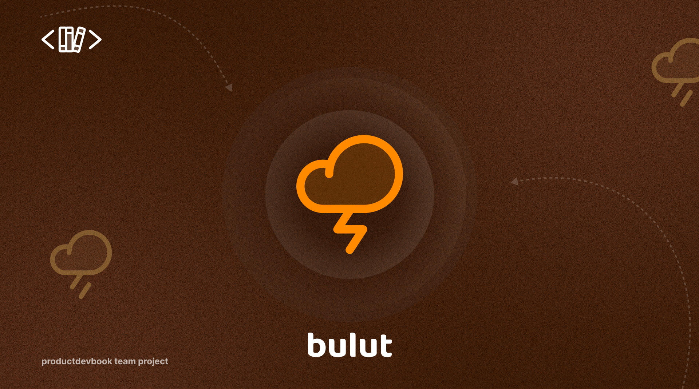

# ☁️ Bulut

🚀 Bulut is a simple deployment tool for your projects.

🥇 It is written in 🐿️ Go and uses :whale: Docker to deploy your projects.

⭐ It is designed to be simple and easy to use.

⚡ Lightning-fast deployment.



## ⬇️ Installation of CLI

### 🐧 Linux & 🍎 Mac

```bash
curl -fsSL https://raw.githubusercontent.com/unitythemaker/bulut/main/cli/install-from-release.sh | bash
```

### 🧰 Build from source

1. Clone the repository
2. Run `go build -o bulut ./cli`
3. Run `./bulut`
4. You can optionally add it to your PATH

## 🖥️ Installation of Server

### :whale: Docker

Currently, there is no Docker image for the server. You can build it yourself.

1. Clone the repository
2. cd into server: `cd server`
3. Run `docker compose up -d`
4. It will be available at `http://localhost:8080`

For debugging, you can run `docker logs -f bulut-server` to see the logs.

### 🧰 Build from source

Currently, there are no prebuilt binaries for the server. You can build it yourself.

1. Clone the repository
2. Run `go build -o bulut-server ./server`
3. Run `./bulut-server`
4. You can optionally add it to your PATH
